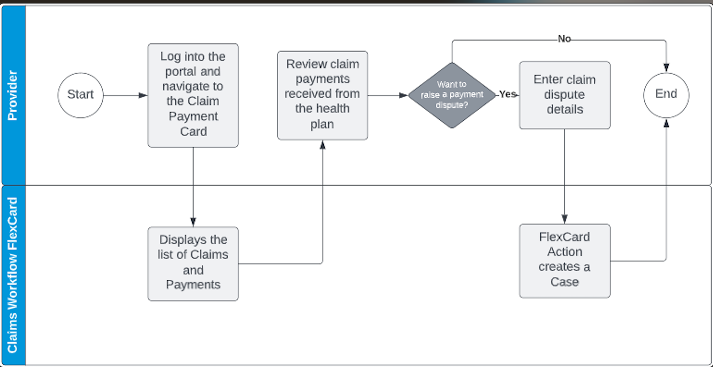
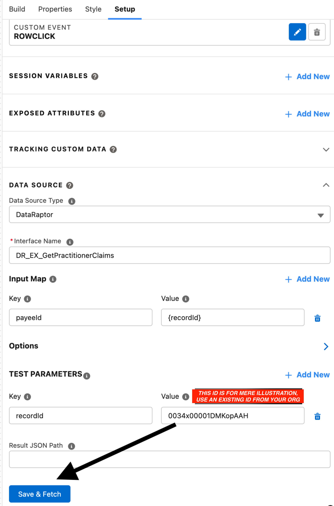
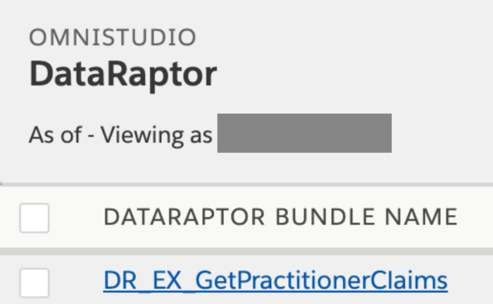
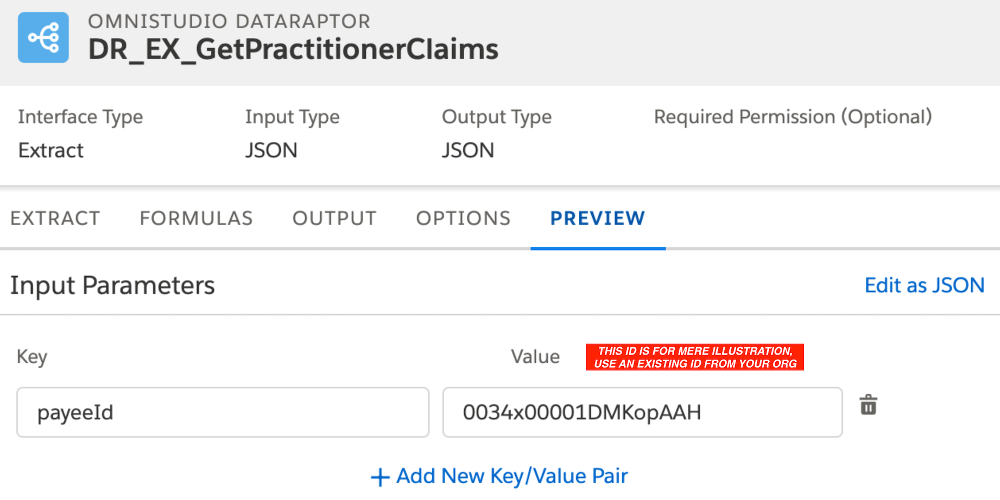
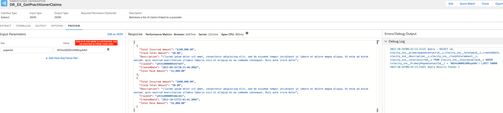
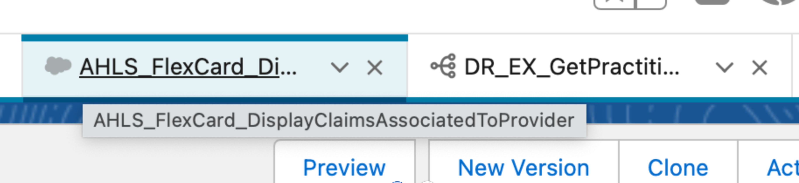
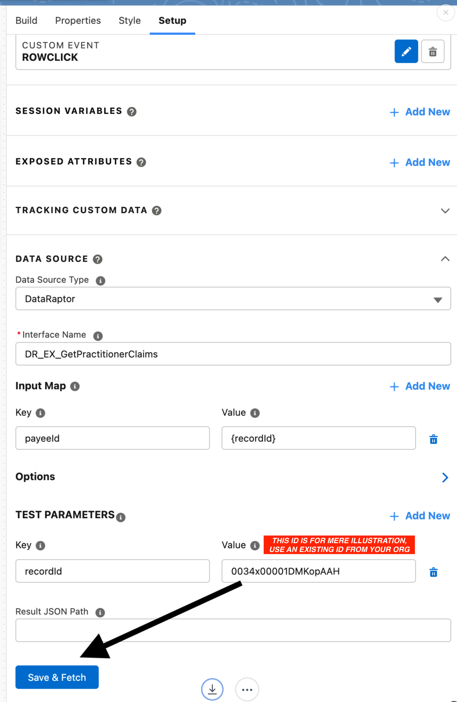

 

*** 

# A-HLS Provider Claim Payment Dispute Workflow Documentation

*A guided decision flow for providers to quickly view their claim payment details from a health plan and raise a dispute for a payment.*

## Overview

Provider Claim Payment Dispute Workflow is a guided workflow for providers to quickly view their claim payment details from a health plan and raise a dispute for a claim payment transaction if needed. 
This process typically happens after a provider files a claim on behalf of a patient. The flow can be called from a Digital Process Automation (DPA) Action from a Salesforce Lightning Page or an Experience Cloud Community. 

#### Use Case Scenario
>
 As a provider, I need to see all my claims with payment details and be able to go through a guided process to log a dispute with the associated health plan for a claim if needed.

## Business Objective

The business objective is to provide a fast and intuitive way for providers to register their disputes with health plans for their claim payments. 

## Business Value and Benefits

- Reduction in administrative costs of handling provider claim payment disputes.
>
- Improvement in provider NPS/satisfaction with the health plan.
>
- Improvement in provider retention/renewal rate.

* * *

## User Story

- Step 1: Provider logs in to the Digital Community.
>
- Step 2: Provider navigates to the Claim Payment Card. It shows the list of claims associated with the provider with payment details.
>
- Step 3: The provider verifies the claims payments from the health plan.
>
- Step 4: The provider logs a dispute by clicking the Dispute link.
>
- Step 5: The provider enters the required details for disputing a payment.
>
- Step 6: A case is created with the details entered. 

* * *

## Package Includes

### 
**OmniScript (1)**

- AHLS_OSDisputeProviderClaimPayment

**OmniScript Associated DataRaptor (4)**

- DRClaimPaymentExtract
- DRSupportCaseRecordTypeExtract
- DRCreateCaseForClaimPayment
- DRCaseIdExtract

**OmniScript Associated Document (1)**

- Astro_Trailblazer_hoodie_thumbsup.png

### 
**FlexCard (1)**

- AHLS_FlexCard_DisplayClaimsAssociatedToProvider 

**FlexCard Associated DataRaptor (1)**
-  DR_EX_GetPractitionerClaims

* * *

## Configuration Requirements

### 
Installation Instructions:
The following steps are required for installation.

Install the Data Pack
-
1. Follow the download steps presented on the Accelerate HLS website for this Accelerator. 
>
3. Alternatively, you may download the Data Pack folder in the following GitHub repository: https://github.com/healthcare-and-life-sciences/Provider-Claim-Dispute-Workflow
> 
5.  Then, complete the following steps to import them into your Salesforce org.
> 
7.  To Import, in your destination Salesforce org, Click on **App Launcher** → Search for '**OmniStudio DataPacks**' and click on it.
>
9. Click on '**Installed**'; on the right side, click on '**Import from**.'
> 
11. Select '**From File**' - When the window opens, select the Data Pack file that you downloaded and stored on your machine. Click '**Install**.'
>
13. When prompted to Activate the OmniScript, choose **Not Now**.

### 
Post-Install Configuration Steps:
-
1. To provide your users access to the Cases/Claims List Views:
	 - Create a 'Permission Set' that grants appropriate access to the desired object. 
	 - Add the Permission set to the end user Profile to grant access to the desired object. 
	 - Repeat steps A and B above for each desired object.
>
2. Click on App Launcher → Search for “OmniScripts.”
       - Navigate to the recently installed OmniScript in the list view.
       - Click on the dropdown at the right of the OmniScript and select '**Activate**'.
       - For more information regarding activating OmniScripts, please see this article: https://help.salesforce.com/s/articleView?id=sf.os_activating_omniscripts.htm&type=5.
>
3. Add the installed OmniScript to the lightning page layout of your choosing. 
      - Refer to this article for more information regarding adding OmniScripts to a Lightning or Experience page: https://help.salesforce.com/s/articleView?id=sf.os_add_a_standard_omniscript_component_to_a_lighting_page_20263.htm&type=5
>
4. Click on **App Launcher** → Search for “FlexCards.”
	- Navigate to the recently installed FlexCard in the list view.
	- Open the FlexCard.
	- Click **Activate** and select the appropriate Publish Options.
	- For more information regarding activating FlexCards, please see this article: https://help.salesforce.com/s/articleView?id=sf.os_activate_a_flexcard_24808.htm&type=5
> 
 5. Add the installed FlexCard to the lightning page layout of your choosing.
	 - Refer to the following articles for more information regarding adding FlexCards to a Lightning or Experience page: 
    - https://help.salesforce.com/s/articleView?id=sf.os_add_a_flexcard_to_a_lightning_page_25127.htm&type=5
    - https://help.salesforce.com/s/articleView?id=sf.os_add_a_flexcard_to_an_experience_page_25183.htm&type=5
>
 6. Add the FlexCard LWC to the desired Lightning Page. For more information on how to add Lightning Web Components to a page, please refer to this help article:
	 - https://help.salesforce.com/s/articleView?id=sf.os_add_a_flexcard_to_a_lightning_page_25127.htm&type=5
>
 7. Remember to ACTIVATE the FlexCard to register its components.

#### [IMPORTANT]  Specific for the FlexCard  '**AHLS_FlexCard_DisplayClaimsAssociatedToProvider'**
>
Data Requirements:

  1. The provided FlexCard '**AHLS_FlexCard_DisplayClaimsAssociatedToProvider**' contains a DataTable that uses a DataRaptor (DR_EX_GetPractitionerClaims) as a Data Source.
>
 2. To preview the FlexCard, make sure you have data at the Object 'vlocity_ins__InsuranceClaims__c' and that you have a proper 'payeeId' as a key value at the preview for the DataRaptor and for the DataTable.
>
 3. If the 'payeeId' is not an existing one at the current ORG, the FlexCard will not render during the preview.

Usage Requirements:

1. This FlexCard is meant to be embedded in a Lighting Record Page to display (as the name suggests) claims associated with a specific Provider.
>
2. See below a click path (IDs are merely illustrative - use existing IDs from your ORG).

***

### Illustrative Click Path to Preview the FlexCard
>
#### 
Step1 
- At the 'App Launcher' Search for 'OmniStudio FlexCards';
- Open the 'OmniStudio FlexCards' application;
- Locate the '**AHLS_FlexCard_DisplayClaimsAssociatedToProvider**' FlexCard;
- Click at the FlexCard 'Active' interface;
- Click at the existing 'Datatable';
- At the 'Setup' Tab;
- Locate the data source;
- Deactivate the FlexCard (if not deactivated already);
- Make sure the 'Data Source Type' is set to 'DataRaptor';
- Make sure the 'Interface Name' is set to '**DR_EX_GetPractitionerClaims**';
- Make sure that at the 'Input Map' the 'Key' is set to 'payeeId' and the 'Value' is set to '{recordId}';
- Make sure that at the 'TEST PARAMETERS' the 'Key' is set to 'recordId'; 
- Make sure that at the 'TEST PARAMETERS' the Value' is filled with an existing/valid '**payeeId**' (vlocity_ins__PrimaryPayeeContactId__c);
- Click '**Save & Fetch**'.

#### 
Step 2

- At the 'App Launcher' Search for 'OmniStudio DataRaptors';
- Click on the 'OmniStudio DataRaptors';
- Search for '**DR_EX_GetPractitionerClaims**', open it;

#### 
Step 3

- At the '**DR_EX_GetPractitionerClaims**' click at the tab 'Preview';
- Make sure the '**Key**' is set to '**payeeId**', and 'Value' is filled with an existing/valid '**payeeId**' (vlocity_ins__PrimaryPayeeContactId__c).

#### 
Step 4

- Click on the 'Execute' Button.

#### 
Step 5

- Return to the 'FlexCard' tab ('AHLS_FlexCard_DisplayClaimsAssociatedToProvider').

#### 
Step 6

- At the 'Setup' tab, click on the 'Save and Fetch' button.

#### 
Step 7

- The datatable embedded at the FlexCard should display the data from the 'vlocity_ins__InsuranceClaim__c' object based on the 'vlocity_ins__PrimaryPayeeContactId__c' attribute.

* * *

## Assumptions

- A customer has licenses for Experience Cloud, Health Cloud, and the HINS Managed Package with OmniStudio. These solutions have all been installed and are functional.
>
- A customer is assuming Salesforce Lightning Experience — not Classic.
>
- Data Model elements that are part of the HINS (Vlocity) Managed package and Health Cloud are all available.
>
 - The Accelerator uses the Lightning Design System standards and look. Customers may want to apply their own branding, which can be achieved.
>
 - Claims and Claim Payments are available in Salesforce.
>
 - The process works in the context of a claim payment Id of a claim. 
>
 - The card runs in the context of the logged-in users’ Id.
>
* * *

## Revision History

- **Revision Short Description (Sep 04, 2019)**
	- Used a custom object for getting claim payment details. 
	- Used three custom fields in **Claim** and **Case** object. 
	- Details are in the **Custom Fields** zip file. 
>
- **Revision Short Description (Oct 09, 2019)**
	- Removed all customizations and used package objects.
>
- **Revision Short Description (Jun 13, 2022)**
	- Converted the OmniScript to LWC.
	- Fixed the associated DataRaptors (see list in the "Package Includes", "DataRaptor" Section).
	-Vlocity Card 'VPL-ProviderClaims-105' converted into a FlexCard ("FCProviderClaimPaymentDispute").
	-Added installation steps and assumptions.
>
 - **Revision Short Description (September 29, 2022)**
		-Rendering issue correction for the OmniScript and FlexCard.
>
 - **Revision Short Description (October 28, 2022)**
	- Included necessary data entries for proper use of the OmniScript and FlexCard.
>
***

